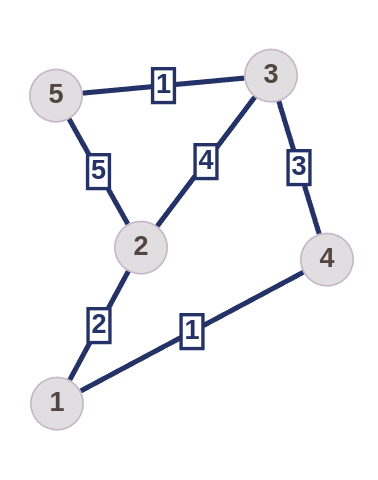
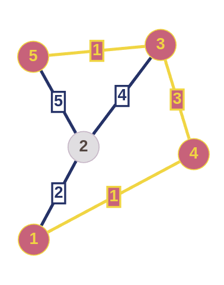
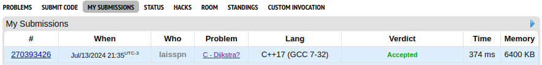
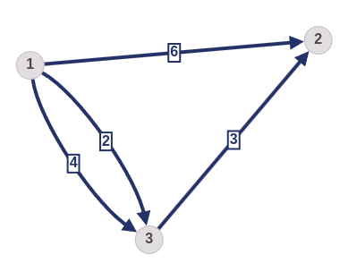
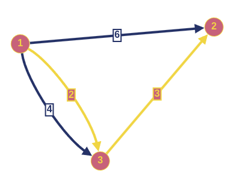
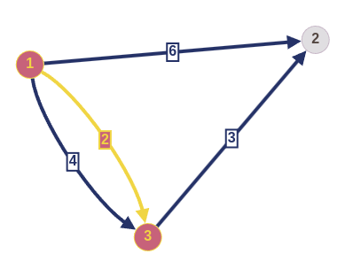
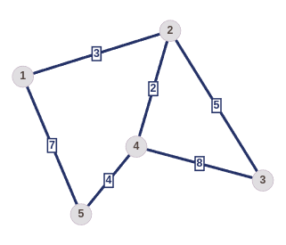
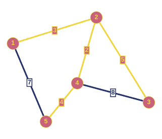
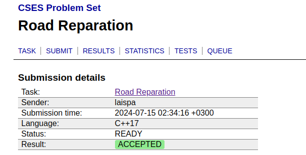

# NomedoProjeto

**Número da Lista**: X 
**Conteúdo da Disciplina**: Grafos 2 

## Alunos
|Matrícula | Aluno |
| -- | -- |
| 19/0046848  |  Lais Portela de Aguiar |

## Sobre 
Resolução de três exercícios de juízes online

1. [Dijkstra?](https://codeforces.com/contest/20/problem/C) - Considerado díficil
2. [Road Reparation](https://cses.fi/problemset/task/1675/)  - Considerado médio
3. [Shortest Routes I](https://cses.fi/problemset/task/1671) - Considerado médio

## Outros 
O vídeo de apresentação foi compartilhado no [google drive](https://drive.google.com/file/d/1NReEijcuRaqwDWQW8Y5ZWlbP38LXRVfN/view?usp=sharing). Por padrão, os videos ficam em baixa qualidade no google drive, para ver na resolução original é só baixar. 

## Screenshots
### Dijkstra?

### Shortest Routes I

### Road Reparation

## Instalação 
**Linguagem**: C++ 
**Framework**: Compilador G++ 
Descreva os pré-requisitos para rodar o seu projeto e os comandos necessários.

## Uso 
Para testar os exercícios basta ir nos links de cada exercício e inserir o arquivo .cpp correspondente, colocando c++17

